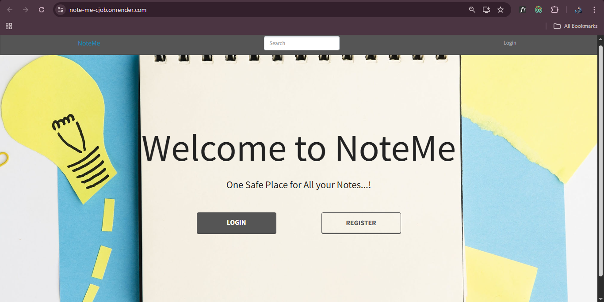
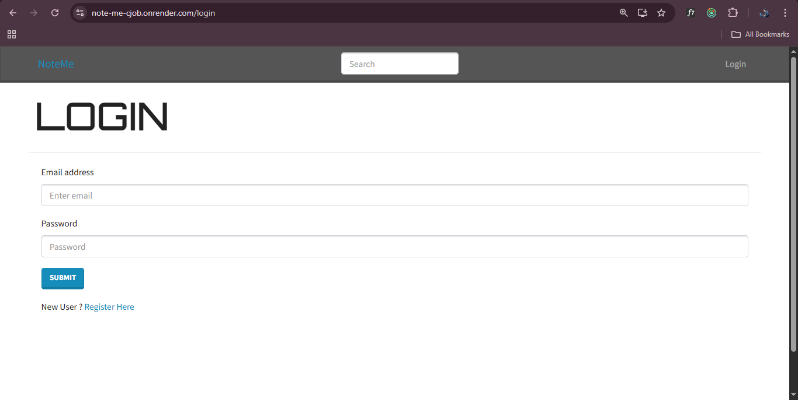
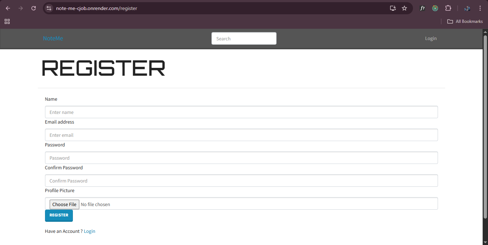
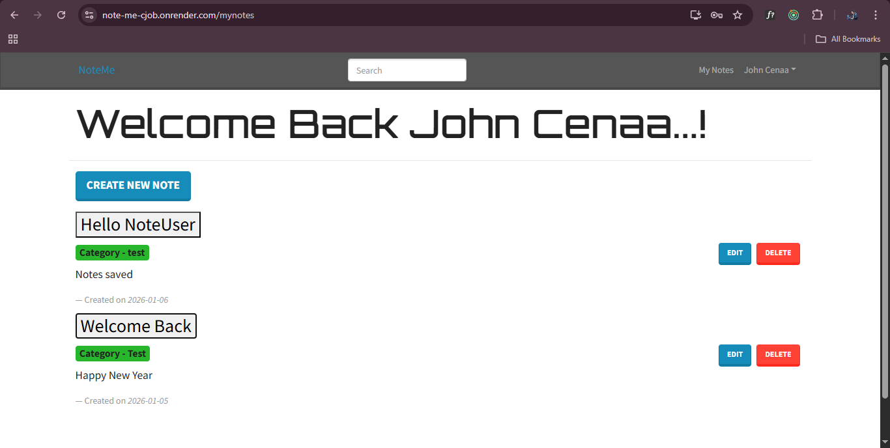
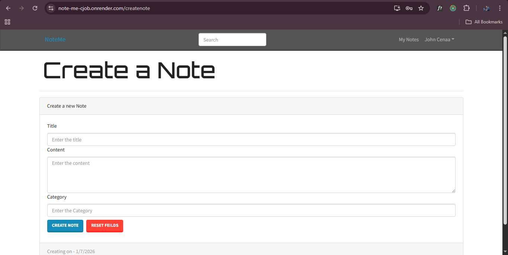
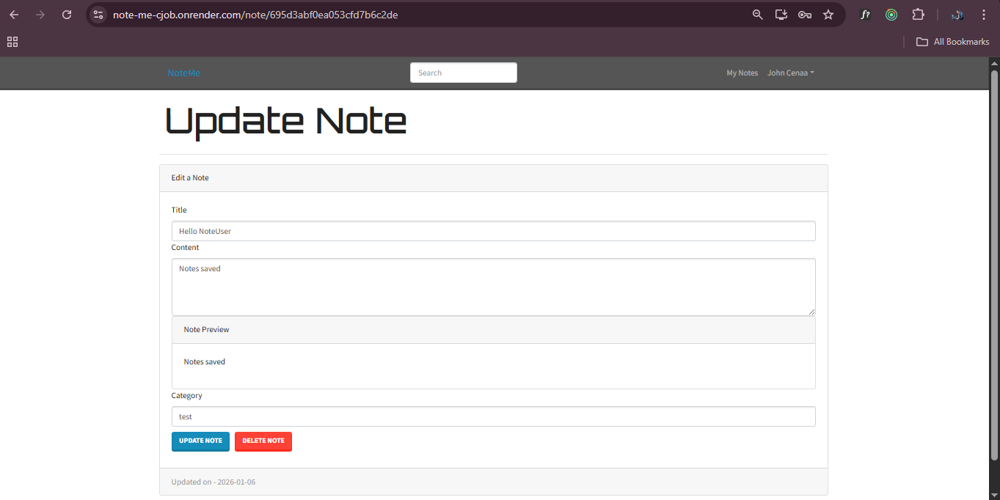

# 📝 NoteMe – Full Stack MERN Notes Application

NoteMe is a full-stack MERN (MongoDB, Express, React, Node.js) application that allows users to securely create, manage, update, and delete personal notes.
The project includes authentication, profile management, Redux state management, and production-ready deployment configuration.
This project was developed end-to-end — from local development to cloud deployment — as a complete learning and implementation experience.

## 🖼️ Screenshots
### Home Screen

### 🔐 Login & Registration

### 📝 My Notes Dashboard

### ✍️ Create & Edit Notes

### 👤 User Profile

## 🌍 Live Demo

🚀 The application is live and deployed on Render:

👉 **Live URL:** [https://noteme.onrender.com](https://note-me-cjob.onrender.com/)

> ⚠️ Note: The app may take a few seconds to load initially due to free-tier cold start.

## 🚀 Core Features :
1. 🔐 User Authentication (Register / Login / Logout)
2. 📝 Create, Read, Update & Delete Notes
3. 🔍 Search Notes by Title
4. 👤 User Profile Management
5. 🖼️ Profile Picture Upload (Cloudinary)
6. 🔑 JWT-based Authorization
7. 🧠 Redux for Global State Management
8. 🌐 RESTful API Architecture
9. ⚙️ Production-ready Deployment Setup

## 🛠️ Tech Stack :
### Frontend ->
React
Redux
React Router DOM
Bootstrap
Axios

### Backend ->
Node.js
Express.js
MongoDB Atlas
Mongoose
JSON Web Tokens (JWT)
bcryptjs

### Deployment & Tools
Git & GitHub
Render (Production Hosting)
MongoDB Atlas
Cloudinary (Profile Images)
Postman (API Testing)

## 📁 Project Structure
NoteMe/
├── backend/
│   ├── config/          # Database connection
│   ├── controllers/     # Business logic
│   ├── middlewares/     # Auth & error handling
│   ├── models/          # Mongoose schemas
│   ├── routes/          # API routes
│   ├── utils/           # Helper utilities
│   └── server.js        # Express server entry
│
├── frontend/
│   └── src/
│       ├── actions/     # Redux actions
│       ├── components/  # Reusable UI components
│       ├── constants/   # Redux constants
│       ├── reducers/    # Redux reducers
│       ├── screens/     # Application pages
│       └── store.js     # Redux store
│
├── package.json         # Root scripts
├── .gitignore
└── README.md

## ⚙️ Environment Variables
Create a .env file in the root directory:

MONGO_URI=your_mongodb_connection_string
JWT_SECRET=your_jwt_secret
NODE_ENV=production 
⚠️ .env is intentionally ignored and never pushed to GitHub.

# ▶️ Running the Project Locally
## 1️⃣ Install Dependencies

npm install
npm install --prefix frontend

## 2️⃣ Start Development Servers
npm run dev

Backend runs on: http://localhost:5000
Frontend runs on: http://localhost:3000

# Production Build
npm run build

This command:
Installs backend dependencies
Installs frontend dependencies
Builds the Rexact application into frontend/build

# Deployment Configuration
The application is configured for production deployment on Render.

## Backend (Web Service)

Build Command: npm run build
Start Command: npm start
Environment: NODE_ENV=production

## Frontend

Served statically from frontend/build via Express in production.

## 🔐 Authentication & Security

Passwords are securely hashed using bcrypt

JWT tokens are issued on login and used for protected routes

Authorization middleware ensures users can only access their own notes

Profile updates and note updates are fully protected

## 🧠 What I Learned From This Project

Full MERN stack integration

Redux architecture and state flow

Secure authentication and authorization

REST API design & middleware usage

Debugging real-world errors (state mutation, auth issues, deployment errors)

Git & GitHub version control best practices

Cloud deployment using Render

## Possible Future Improvements

Rich text editor for notes

Tags and categories

Pagination & sorting

Dark mode

Note sharing between users

# 👨‍💻 Author

Jay Parmar
Final Year Computer Engineering Student
Learning Full-Stack Development & Cloud Deployment

⭐ Support

If you find this project helpful, feel free to ⭐ the repository.
